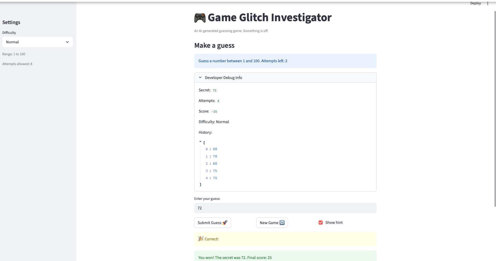

# 🎮 Game Glitch Investigator: The Impossible Guesser

## 🚨 The Situation

You asked an AI to build a simple "Number Guessing Game" using Streamlit.
It wrote the code, ran away, and now the game is unplayable. 

- You can't win.
- The hints lie to you.
- The secret number seems to have commitment issues.

## 🛠️ Setup

1. Install dependencies: `pip install -r requirements.txt`
2. Run the broken app: `python -m streamlit run app.py`

## 🕵️‍♂️ Your Mission

1. **Play the game.** Open the "Developer Debug Info" tab in the app to see the secret number. Try to win.
2. **Find the State Bug.** Why does the secret number change every time you click "Submit"? Ask ChatGPT: *"How do I keep a variable from resetting in Streamlit when I click a button?"*
3. **Fix the Logic.** The hints ("Higher/Lower") are wrong. Fix them.
4. **Refactor & Test.** - Move the logic into `logic_utils.py`.
   - Run `pytest` in your terminal.
   - Keep fixing until all tests pass!

## 📝 Document Your Experience

**game's purpose.**
The purpose of the game is to be a number guessing game. There are three difficulties in which the number of attempts you have along with the possible range of the number varies. Your aim is to get the guess in the least amount of tries to maximize your score.

**Bugs found**

Some bugs I found were that : \n

- the secret number kept changing: it was generated unconditionally at the top level
- hints were inverted: a guess that was too high printed out too low and vice versa
- the invalid input (i.e. strings) were being counted as attempts and breaking attempt count logic
- new games ignored difficulty. range was 1-100 regardless

**fixes applied.**
- secret number: Fixed with the if "secret" not in st.session_state guard.
- inverted hints: just inverted them back
- invalid inputs: checked for valid input before incrementing attempts
- game difficulty: fixed the if statements to show proper ranges based on selected difficulty

## 📸 Demo

- [ ] [Insert a screenshot of your fixed, winning game here]

## 🚀 Stretch Features

- [ ] [If you choose to complete Challenge 4, insert a screenshot of your Enhanced Game UI here]
